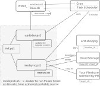

# Installation

## Install on linux

Go to directory where it should reside.
Setup will download files and add cron entry:

`
wget -O - "https://api.github.com/repos/element36-io/arzt.shopping-api/contents//medsync/medsync.sh?ref=medisync" |  jq -r '.content' | base64 --decode | bash
`

The Script should not produce any errors.
You may manually test the update function, which will check for 
new documents and copy them to the configured directory (default to ./out), 
see [medsync.txt](medsync.txt)
You need to put an order at demo.arzt.shopping to test it.

`
./medsync.sh medsync
`

## Install on Windows

TBD

## Both: modify medsync.txt and store key.p12

You need to get the proper values from mail@arzt.shopping and modify the file. 

[medsync.txt](medsync.txt)

Put key.p12 into the same directory. 

Test installation by using YOUR OWN domain (e.g. medis.praxis-baar.ch)
and place an order. You may trigger the script manually with: 

`
./medsync.sh medsync
`
# Architecture

Three main components: 

- install_ Script: Downloads files from github. 
- updater: A scripts which updats local scipts by comparing with online version.  
- medsync: This is the mainscript. It checks for new PDFs (orders), download them 
  into a folder which is checked for and which starts the import. After that, the 
  documents gets deletes.

Scripts are in powershell if possible. PowerShell runs on Linux using docker and
on Windows natively. No libraries are needed for installation. 

